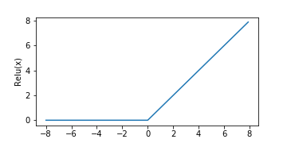
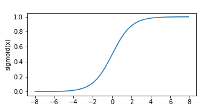
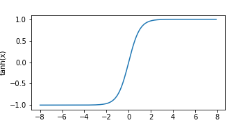
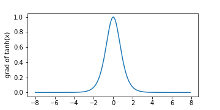
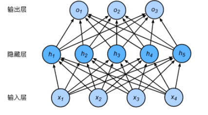
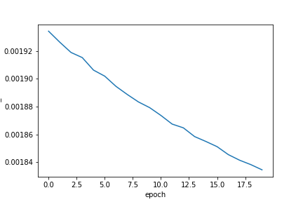
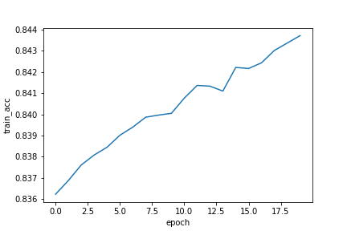
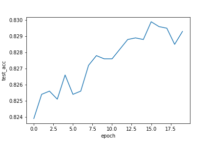
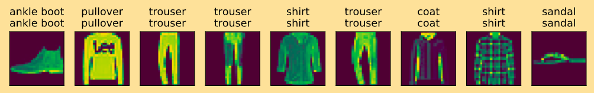

## Pytorch之多层感知机与Softmax

### 激活函数

**目的:**增加网络的非线性拟合的能力

- **绘制激活函数**

  ```python
  #定义一个激活函数的的绘制函数
  import torch as t
  import matplotlib.pyplot as plt 
  import numpy as np
  from torch.nn import init
  from torch import nn
  import sys
  sys.path.append("..")
  import d2lzh_pytorch as d2l
  
  
  def plot_activation(x_vals, y_vals, name):
      """可视化激活函数"""
      plt.figure(figsize=(5, 2.5))
      plt.plot(x_vals.data.numpy(), y_vals.data.numpy())
      plt.xlabel("x")
      plt.ylabel(name + "(x)")
      plt.savefig("./imgs/%s.png" % name)
      plt.show()
      
  # 可以依次绘制激活函数 relu, simgmoid, tanh 的原函数
  X = t.arange(-8.0, 8.0, 0.1, requires_grad=True)
  y = t.relu(X)
  plot_activation(x_vals=X, y_vals=y, name="Relu")
  ```

  |  |  |  |
  | :------------------: | :---------------------: | :------------------: |
  |         relu         |         sigmoid         |         tanh         |

- **绘制激活函数相应的导数**

  ```python
  # relu求导
  y.sum().backward()
  plot_activation(X, X.grad, "grad of relu")
  ```

  |  |  |  |
  | :--------------------------: | :-----------------------------: | :--------------------------: |
  |         grad of relu         |         grad of sigmoid         |         grad of tanh         |

- 关于激活函数的选择

  1. ReLu函数是一个通用的激活函数，目前在大多数情况下使用。但是，ReLU函数只能在隐藏层中使用。

  2. 用于分类器时，sigmoid函数及其组合通常效果更好。由于梯度消失问题，有时要避免使用sigmoid和tanh函数。  

  3. 在神经网络层数较多的时候，最好使用ReLu函数，ReLu函数比较简单计算量少，而sigmoid和tanh函数计算量大很多。

  4. 在选择激活函数的时候可以先选用ReLu函数如果效果不理想可以尝试其他激活函数。

### 多层感知机

- 网络结构图

  

- 原理

  ```python
  # 0. 加载数据
  batch_size = 256
  train_iter, test_iter = d2l.load_data_fashion_mnist(batch_size, root="./data/")
  
  # 1. 定义参数
  num_inputs, num_outputs, num_hiddens = 784, 10, 256
  
  W1 = t.tensor(np.random.normal(0, 0.01, (num_inputs, num_hiddens)), dtype=t.float)
  b1 = t.zeros(num_hiddens, dtype=t.float)
  
  W2 = t.tensor(np.random.normal(0, 0.01, (num_hiddens, num_outputs)), dtype=t.float)
  b2 = t.zeros(num_outputs, dtype=t.float)
  
  params = [ W1, b1, W2, b2]
  
  # 设置为梯度可更新
  for param in params:
      param.requires_grad_(requires_grad = True)
      
  # 3. 定义网络与激活函数
  def relu(X):
      return t.max(input=X, other=t.tensor(0.0))
  
  def net(X):
      X = X.view(-1, num_inputs)
      H = relu(t.matmul(X, W1) + b1)
      return t.matmul(H, W2) + b2
  
  # 4. 训练
  loss = t.nn.CrossEntropyLoss()
  num_epochs, lr = 5, 100.0
  d2l.train_ch3(net, train_iter, test_iter, loss, num_epochs,
  batch_size, params, lr)
  ```

  ```
  epoch 1, loss 0.0031, train acc 0.713, test acc 0.793
  epoch 2, loss 0.0019, train acc 0.821, test acc 0.766
  epoch 3, loss 0.0017, train acc 0.842, test acc 0.803
  epoch 4, loss 0.0015, train acc 0.856, test acc 0.810
  epoch 5, loss 0.0015, train acc 0.864, test acc 0.839
  ```

- pytorch简洁实现

  ```Python
  num_inputs, num_outputs, num_hiddens = 784, 10, 256
  
  # 0.定义一个网络
  class LinearNet(nn.Module):
      def __init__(self, num_inputs, num_hiddens, num_outputs):
          super(LinearNet, self).__init__()
          self.linear = nn.Sequential(
              nn.Linear(num_inputs, num_hiddens)
              , nn.ReLU(inplace=True)
              , nn.Linear(num_hiddens, num_outputs)
          )
      
      def forward(self, x):
          x = self.linear(x.view(x.shape[0], -1))
          return x
          
  net = LinearNet(num_inputs, num_hiddens, num_outputs)
  
  
  # 1.参数的初始化
  for name, param in net.named_parameters():
      if name.split(".")[2] == "weight":
          nn.init.normal_(param, 0, 0.01)
      else:
          nn.init.constant_(param, val = 0) 
          
  # 2. 训练
  batch_size = 256
  loss = t.nn.CrossEntropyLoss()
  optimizer = t.optim.SGD(net.parameters(), lr=0.5)
  num_epochs = 5
  d2l.train_ch3(net, train_iter, test_iter, loss, num_epochs,
  batch_size, None, None, optimizer)
  ```

  ```
  epoch 1, loss 0.0014, train acc 0.868, test acc 0.857
  epoch 2, loss 0.0014, train acc 0.872, test acc 0.808
  epoch 3, loss 0.0013, train acc 0.878, test acc 0.814
  epoch 4, loss 0.0013, train acc 0.881, test acc 0.855
  epoch 5, loss 0.0012, train acc 0.887, test acc 0.858
  ```

###　Softmax

- 数据集

  ​		`Fashion-MNIST`是一个替代[MNIST手写数字集](http://yann.lecun.com/exdb/mnist/)的图像数据集。 它是由Zalando（一家德国的时尚科技公司）旗下的[研究部门](https://research.zalando.com/)提供。其涵盖了来自10种类别的共7万个不同商品的正面图片。Fashion-MNIST的大小、格式和训练集/测试集划分与原始的MNIST完全一致。60000/10000的训练测试数据划分，28x28的灰度图片。你可以直接用它来测试你的机器学习和深度学习算法性能，且**不需要**改动任何的代码。

  **github下载链接:** git clone git@github.com:zalandoresearch/fashion-mnist.git

- 原理(数据)

  ```python
  # import needed package
  %matplotlib inline
  from IPython import display
  import matplotlib.pyplot as plt
  
  import torch as t
  import numpy as np
  import torchvision
  from torch import nn
  import torchvision.transforms as transforms
  import time
  from torch.nn import init
  from tqdm import tqdm
  import sys
  sys.path.append("..") # 为了导⼊上层⽬录的d2lzh_pytorch
  import d2lzh_pytorch as d2l
  
  
  # pytorch处理的数据为tensor类型
  mnist_train = torchvision.datasets.FashionMNIST(root="./data/"
                                                  , train=True
                                                  , download=True
                                                  , transform=transforms.ToTensor())
  mnist_test = torchvision.datasets.FashionMNIST(root="./data/"
                                                 , train=False
                                                 , download=True
                                                 , transform=transforms.ToTensor())
  # 显示label
  def get_fashion_mnist_labels(labels):
      text_labels = ['t-shirt', 'trouser', 'pullover', 'dress',
      'coat','sandal', 'shirt', 'sneaker', 'bag', 'ankle boot']
      
      return [text_labels[int(i)] for i in labels]
  # 显示标签和图片
  def show_fashion_mnist(images, labels):
      """显示图片"""
      fig, axs = plt.subplots(1, len(labels), figsize=(12, 12))
      for ax, img, label in zip(axs, images, labels):
          ax.imshow(img.view(28, 28).numpy())
          ax.set_title(label)
          # 设置边框不可见
          ax.axes.get_xaxis().set_visible(False)
          ax.axes.get_yaxis().set_visible(False)
      plt.savefig("./imgs/visiual_img.png")
      plt.show()
      
  X = []
  Y = []
  for i  in range(10):
      X.append(mnist_train[i][0])
      Y.append(mnist_train[i][1])
  show_fashion_mnist(X, get_fashion_mnist_labels(Y))
  ```

  图片显示:

- 代码原理

  ```python
  # 参数的初始化
  num_inputs = 784
  num_outputs = 10
  W = t.tensor(np.random.normal(0, 0.01, (num_inputs,
  num_outputs)), dtype=torch.float)
  b = torch.zeros(num_outputs, dtype=torch.float)
  
  W.requires_grad_(requires_grad=True)
  b.requires_grad_(requires_grad=True)
  
  # 定义softmax 网络
  def softmax(X):
      X_exp = X.exp()
      # dim = 1 行
      partition = X_exp.sum(dim=1, keepdim=True)
      return X_exp/partition
  # 定义网络
  def net(x):
      return softmax(torch.mm(x.view(-1, num_inputs), W) + b) 
      
  def cross_entropy(y_hat, y):
      return - torch.log(y_hat.gather(1, y.view(-1, 1)))
      
  def accuracy(y_hat, y):
      return (y_hat.argmax(dim=1) == y).float().mean().item()
      
  # 准确率的使用
  def evaluate_accuracy(data_iter, net):
      acc_sum, n = 0.0, 0
      
      for X, y in data_iter:
          acc_sum += (net(X).argmax(dim=1) == y).float().sum().item()
          n += y.shape[0]
      return acc_sum/n
      
  # 可视化数据
  def plot(X, y, name):
      plt.plot(X, y)
      plt.xlabel("epoch")
      plt.ylabel(name)
      plt.savefig("./imgs/"+name+".png")
      plt.show()
  ## 训练
  def train(net, train_iter, test_iter, loss, num_epochs, batch_size, params=None, lr=None
            , optimizer = None):
      test_acc = []
      train_acc = []
      train_loss = []
      for epoch in range(num_epochs):
          train_l_sum, train_acc_sum, n = 0.0, 0.0, 0
          for X, y in train_iter:
              y_hat = net(X)
              # 计算loss
              l = loss(y_hat, y).sum()
              # 梯度清零
              if optimizer is not None:
                  optimizer.zero_grad()
              elif params is not None and params[0].grad is not None:
                  for param in params:
                      param.grad.zero_()
              
              # 计算梯度
              l.backward()
              # 梯度更新
              if optimizer is None:
                  d2l.sgd(params, lr, batch_size)
              else:
                  optimizer.step()
                  
              # 计算train loss
              train_l_sum += l.item()
              
              #train accuracy
              train_acc_sum += (y_hat.argmax(dim=1) == y).sum().item()
              n += y.shape[0]
          train_loss.append(train_l_sum/n)
          train_acc.append((train_acc_sum / n))
          test_acc.append(evaluate_accuracy(test_iter, net))
          print('epoch %d, loss %.4f, train acc %.3f, test acc %.3f'% (epoch + 1, train_loss[epoch], train_acc[epoch],
  test_acc[epoch]))
      
      # 可视化
      plot(range(num_epochs), train_loss, name="train_loss")
      plot(range(num_epochs), train_acc, name="train_acc")
      plot(range(num_epochs), test_acc, name="test_acc")  
      
  num_epochs, lr = 20, 0.1
  train(net, train_iter, test_iter, cross_entropy, num_epochs,
  batch_size, [W, b], lr)   
  ```

  |  |  |  |
  | :--------------------------------: | :-----------------------: | :------------------------------: |
  |             train_loss             |         train_acc         |             test_acc             |

- 测试

  ```python
  X, y = iter(test_iter).next()
  true_labels = d2l.get_fashion_mnist_labels(y.numpy())
  pred_labels = d2l.get_fashion_mnist_labels(net(X).argmax(dim=1).numpy())
  titles = [true + '\n' + pred for true, pred in zip(true_labels,pred_labels)]
  d2l.show_fashion_mnist(X[0:9], titles[0:9])
  ```

  

### 知识点

#### 1.torchvision的用法

1. torchvision.datasets : ⼀些加载数据的函数及常⽤的数据集接⼝；
2. torchvision.models : 包含常⽤的模型结构（含预训练模型），例如AlexNet、 VGG、
ResNet等；
3. torchvision.transforms : 常⽤的图⽚变换，例如裁剪、旋转等；
4. torchvision.utils : 其他的⼀些有⽤的⽅法  

#### 2.torch对维度操作  
给定⼀个 Tensor 矩阵 X 。我们可以只对其中同⼀列（ dim=0 ）或同⼀⾏（ dim=1 ）的元素求
和，并在结果中保留⾏和列这两个维度（ keepdim=True ）